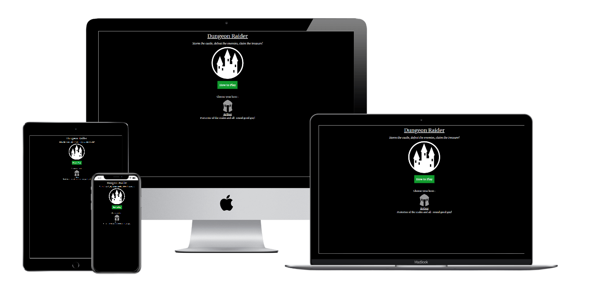
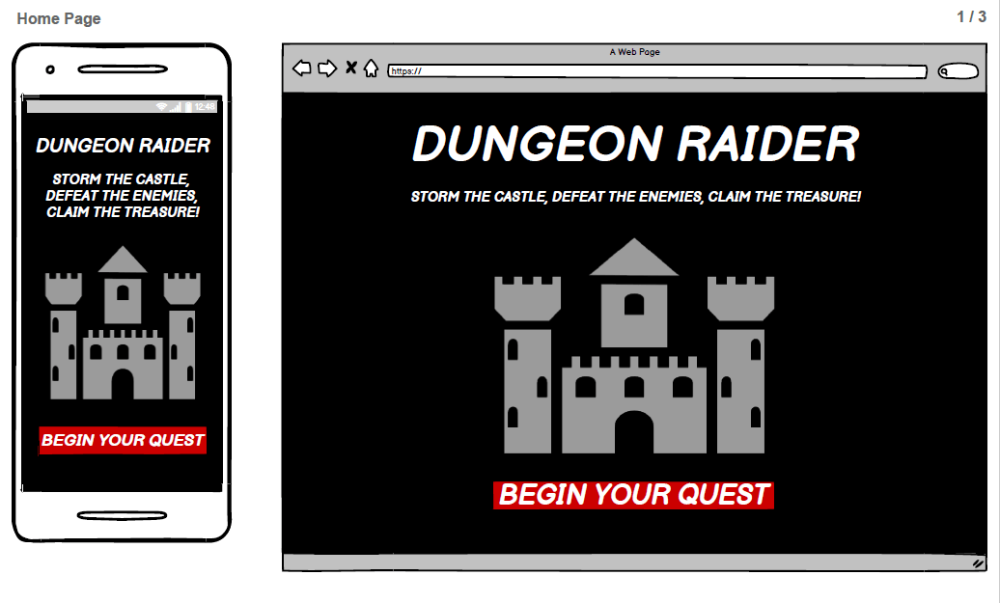
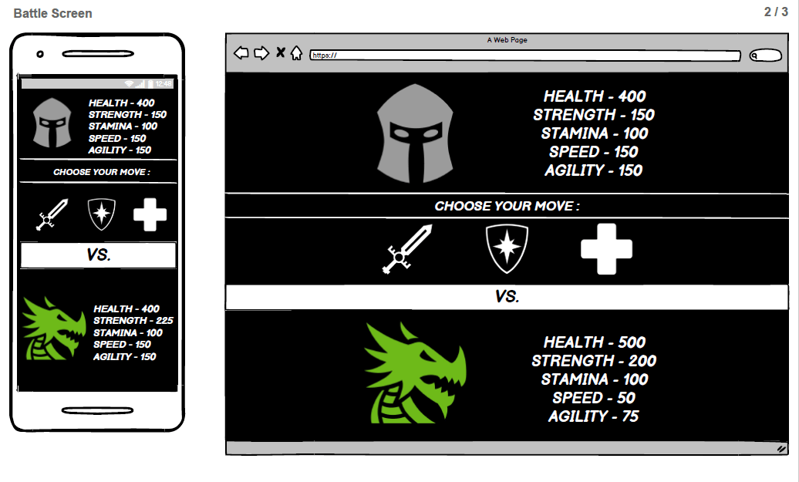
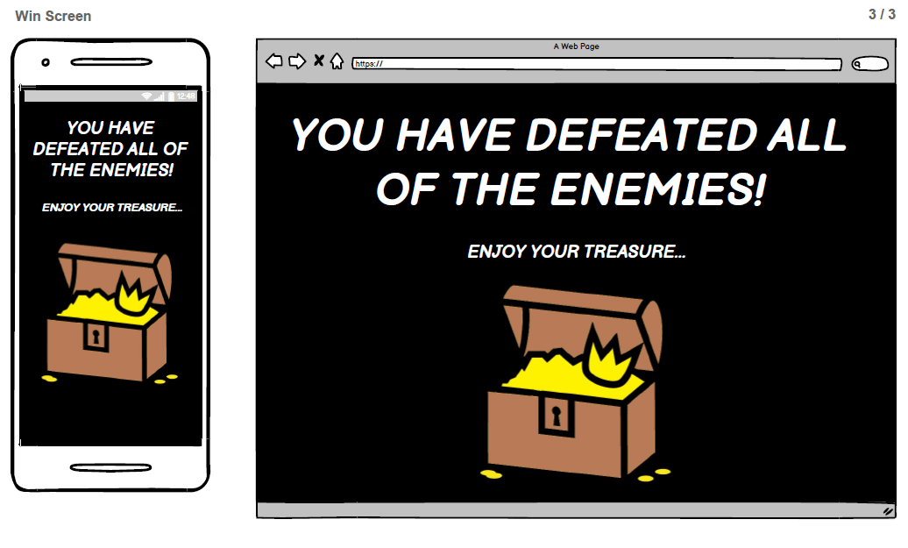
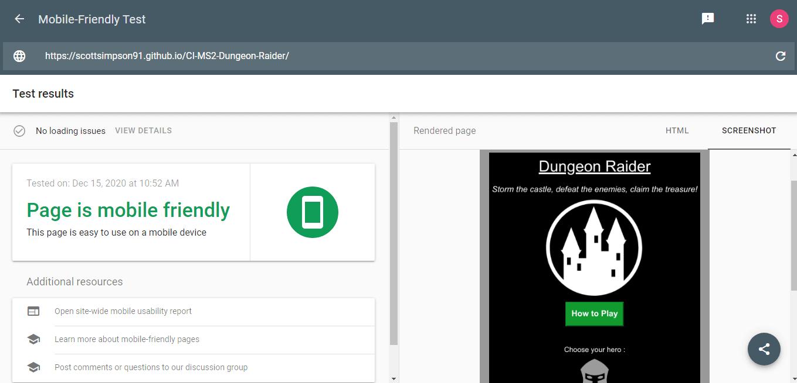
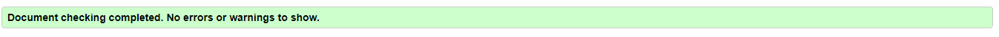
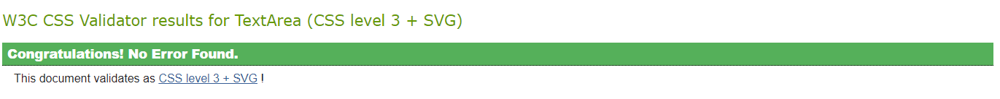
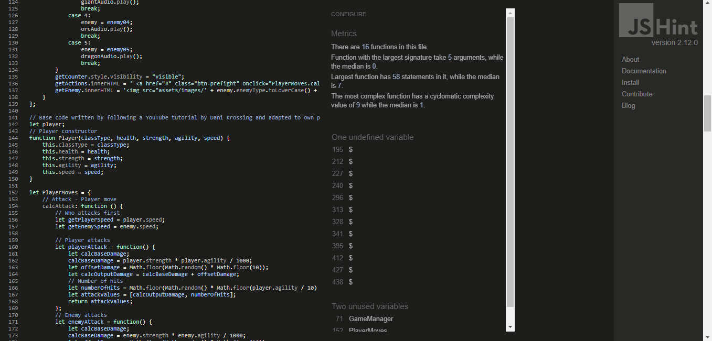

# [Dungeon Raider](https://scottsimpson91.github.io/CI-MS2-Dungeon-Raider/)

[View the live project here](https://scottsimpson91.github.io/CI-MS2-Dungeon-Raider/)

The aim of my second project for the Code Institute was to create a basic turn-based combat game written using JavaScript, HTML and CSS.

## Contents:

* [Description](#description)
* [User Stories](#user-stories)
* [Market Research](#market-research)
* [UX and Features](#ux-and-features)
* [Future Improvements](#future-improvements)
* [Changes](#changes)
* [Technologies Used](#technologies-used)
* [Testing](#testing)
* [Deployment](#deployment)
* [Credits](#credits)
* [Acknowledgements](#acknowledgements)
* [Support](#support)

## <a name="description">Description</a>

Dungeon Raider was designed as a basic turn-based combat game using JavaScript, HTML and CSS. The aim of the game is to storm the castle, defeat three random enemies and claim the treasure.

The game has been created using only one HTML page which then gets edited using JavaScript. There is no navigation bar or footer included throughout the website as I felt this was not needed.

The reason this approach was chosen, was to highlight the developers use and knowledge of manipulating the DOM using JavaScript and it did not feel necessary to include the above components.

## <a name="user-stories">User Stories</a>

* "I want to easily understand how to play the game and learn about the different game mechanics"
* "I want to be able to navigate around the website easily and initiate and control actions"
* "I want to be able to access the website using my mobile device as this is what I would frequently use to play simple games like this"
* "I want to be able to perform different moves rather than just attacking"
* "I want some element of luck to come in to the game to ensure each combat round is different"
* "I want to be able to fight random enemies, so each time I play the game I am getting a different experience"

## <a name="market-research">Market Research</a>

I decided to carry out research into different types of games that were similar to find out what core elements needed to be included.

All this information was used when designing the layout, colour scheme, typography, imagery, audio and features that were deployed to the final website and contributed to the above User Stories.

## <a name="ux-and-features">UX and Features</a>

The website was designed for gamers of all ages who enjoy turn-based combat games. It was designed to be a simple website that was easy to navigate and was responsive on all devices.

#### 1. Strategy

The aim of the project was to create a simple turn-based combat game using JavaScript, HTML and CSS that could be built upon in the future to include more features.

##### Customer Goals

* Easy to find instructions on how to play the game and understand the game mechanics before playing
* Easy to use controls and the ability to replay the game by clicking a button
* Easy to see progress through the game via a progress tracker/counter
* Different types of enemies to fight to vary the experience and strategy needed to progress
* Different types of player moves to vary the experience rather just both the player and enemy attacking until someone loses
* Mobile first design as this is likely the most frequent way of accessing and playing the game

#### 2. Scope

The scope of the project and features to include were influenced by the market research carried out in to similar games already released. In it's current state the game is quite basic, but it can easily be built on in the future to include a number of new features. It should be a mobile-first website that is responsive on all devices.

##### Current Features

As this project currently only features one page (index.html), I have broken down the features into sections as they appear on the screen once the player has clicked various buttons to progress.

* ###### Home Page

  * Basic description of the game to let the player know the concept and goal of the game (Storm the castle, defeat the enemies, claim the treasure)
  * Large how to play button which opens a modal to explain the game concept and different mechanics involved
  * Basic instructions on what you need to do to start the game (Choose a hero)
  * Simple description of the hero and what their strengths are will allow the player to select their hero depending on how they want to play (At present, there is only one hero to choose from)

* ###### Search for Enemy Page

  * Large search for enemy button in the middle of the screen to clearly indicate the way to progress is by clicking the button
  * Hero stats are visible and clear to the user (Each stat and what it does is clearly explained when the player clicks the how to play button on the initial landing page)

* ###### Combat Page

  * Enemy stats are now visible too and are clear to the user and they are now able to compare them to the player to see what strategy they may need to employ
  * Player move buttons now appear on the screen alongside a descriptive image (Each move and what it does is clearly explained when the player clicks the how to play button on the initial landing page)
  * Combat log is visible in the middle of the page which outlines what both the player and enemy has done for that turn
  * Health stats for the player and enemy will now change after each turn has concluded
  * Enemies defeated counter now appears at the top of the page to show the player their progress through the game (Instructions on how to win are clearly explained when the player clicks the how to play button on the initial landing page - they need to defeat three enemies)

* ###### Outcome Page

  * If a player has won the game a modal will appear explaining they have won and will show them their treasure
  * If a player has lost the game a modal will appear explaining that they have lost
  * Both outcomes will display a clear restart game button in the modal which allows the player to return to the initial landing page

#### 3. Structure

The game was designed to initially have one HTML page which would then use JavaScript to edit the page as necessary. This was done to highlight the use of JavaScript and the ability to manipulate the DOM.

Short and easy to read paragraphs were used to easily explain to the player what they need to do to play the game. Clear buttons were displayed throughout the game to indicate to the player what was required of them.

A selection of images were used across the website to be engaging and were all similar in design to enhance UX.

A selection of audio files were used across the website to be simple and engaging and were all similar in sound to enhance UX. There are no audio controls for the game as the player can simply control all audio from their device.

#### 4. Skeleton

The wireframe for the website was created using [Balsamiq](https://balsamiq.com/). The game was designed to initially have one HTML page which would then use JavaScript to edit the page as necessary, so I have broken the wireframes down in to the core sections a player would see as they progress through the game.

###### Home Page

###### Battle Screen

###### Win Screen

#### 5. Surface

##### Design

* ###### Colour Scheme

  * The three main colours used throughout the website were black (#000), white (#FFF) and a dark grey (\#303030) as these colours represent light and dark, good and evil and also being in a dungeon it would be quite dark and gloomy, so these colours felt suitable
  * The above colours were combined with green (\#119B2E) and red (\#B22222) which were used for various buttons throughout the game to make it stand out for the user and to give the game some colour
  * The hero and enemy colours were what you would typically expect from what they are and are standard across all games of this type

* ###### Typography

  * Merriweather was used as the main font throughout the website as it was easy to read across all devices and fit with the other elements
  * Serif was used as a backup font should the primary one not load

* ###### Imagery

  * All images for the game were sourced from [Game Icons](https://game-icons.net/) and were styled by using the editor on their website

  * All images were sourced from the same website to ensure they remained consistent in style and design across the website, which would improve UX

    

* ###### Audio

  * All audio files were sourced from [Zapsplat](https://www.zapsplat.com/) and are all similar in sound to enhance UX
  * All audio files are of a similar length to enhance UX

## <a name="future-improvements">Future Improvements</a>

* More heroes to be included (Mage, Hunter, Assassin) which would have different stats and abilities
* Mana or Stamina system to vary the types of attacks/strategy the player must employ
* Improvements to UI such as health bars and attack animations

## <a name="changes">Changes</a>

There were a few changes that were made after the initial wireframe was created, these include:

* One HTML page rather than three (Home, Battle Screen, Win Screen) to highlight the ability of the developer to manipulate the DOM and change the HTML elements on one page
* The use of modal pop-ups rather than alerts for win/loss status as the alerts were annoying and would have caused a bad UX
* The inclusion of a combat log for the damage of the player/enemy as the alerts were annoying and would have caused a bad UX
* An images of the player moves next to the image to make it clear what each move did
* Removing the stamina element of the game as this was not required at the time of creation, however there are plans to implement this back in to the game in the future

## <a name="technologies-used">Technologies Used</a>

##### Languages Used

* [HTML5](https://en.wikipedia.org/wiki/HTML5)
* [CSS3](https://en.wikipedia.org/wiki/CSS)
* [JavaScript](https://en.wikipedia.org/wiki/JavaScript)

##### Frameworks, Libraries & Programs Used

* [Bootstrap](https://getbootstrap.com/)
* [Hover.css](https://ianlunn.github.io/Hover/)
* [Google Fonts](https://fonts.google.com/)
* [jQuery](https://jquery.com/)
* [Git](https://git-scm.com/)
* [GitHub](https://github.com/)
* [Balsamiq](https://balsamiq.com/)
* [Microsoft Paint](https://en.wikipedia.org/wiki/Microsoft_Paint)
* [Typora](https://typora.io/)
* [Techsini](http://techsini.com/multi-mockup/index.php)
* [Chrome DevTools](https://developers.google.com/web/tools/chrome-devtools)
* [TinyPNG](https://tinypng.com/)
* [Autoprefixer CSS](https://autoprefixer.github.io/)
* [Favicon.cc](https://www.favicon.cc/)
* [Game Icons](https://game-icons.net/)
* [Zapsplat](https://www.zapsplat.com/)

## <a name="testing">Testing</a>

##### User Story Testing

* "I want to easily understand how to play the game and learn about the different game mechanics"

  * Clear how to play button included on the home page which explains the goal of the game and the game mechanics

    

* "I want to be able to navigate around the website easily and initiate and control actions"

  * Clear buttons appear throughout the game to indicate what the player has to do to progress

  * The game is controlled by clicking and utilises onclick functions to progress the game

    

* "I want to be able to access the website using my mobile device as this is what I would frequently use to play simple games like this"

  * [Google's Mobile-Friendly Test](https://search.google.com/test/mobile-friendly) was used and the results were that the 'Page is mobile friendly - this page is easy to use on a mobile device'.

  

  

  

  * Website was tested across various different mobile devices and browsers

* "I want to be able to perform different moves rather than just attacking"
  * There are three different moves which a player is able to make - Attack, Counter and Heal
  * All moves need to be used together in different combination to progress through the game

* "I want some element of luck to come in to the game to ensure each combat round is different"

  * The use of Math.random and Math.floor brings an element of luck to the game as the player and enemy will each do different attack damage and number of attacks each round

    

* "I want to be able to fight random enemies, so each time I play the game I am getting a different experience"

  * The use of Math.random and Math.floor chooses an enemy at random, so each time the game is played, different enemies appear and in different orders

##### General Testing

* Tested how to play modal to ensure it opens and closes

* Tested the choose hero button

* Tested the search for enemy button

* Tested the audio files play for the correct characters and modal at the correct time

* Tested all hero moves work

* Tested the win and lose modal restart buttons

* CSS was put through a [CSS Autoprefixer](https://autoprefixer.github.io/) and there were no changes to be made

  

##### Validation

The W3C Markup Validator, W3C CSS Validator and JSHint services were used to validate every page of the project to ensure there were no syntax errors in the project.

[W3C Markup Validator](https://validator.w3.org/) 

* index.html - No errors or warnings to show

  

  

  

[W3C CSS Validator](https://jigsaw.w3.org/css-validator/)

* style.css - No errors found

  

  

  

[JSHint](https://jshint.com/)

* enemy.js - No errors found
* gamemanager.js - No errors found
* player.js - No errors found

​		

JSHint does not parse all of jQuery well, and the $ sign that appears above is showing as an error. It isn't, however, and it can be ignored.

JSHint is showing two undefined variables GameManager and PlayerMoves:

* GameManager - Defined on index.html and is used as part of an onclick event, so does not get passed through JSHint, hence why the error is appearing
* PlayerMoves - Is part of GameManager and is inserted using JavaScript and is used as part of an onclick event, so does not get passed through JSHint, hence why the error is appearing

##### Devices

The website was initially tested on different types of devices using Chrome DevTools to see if there were any immediate issues. The website works well on all mobile devices from 320px and upwards.

[Google's Mobile-Friendly Test](https://search.google.com/test/mobile-friendly) was used and the results were that the 'Page is mobile friendly - this page is easy to use on a mobile device'.

The website was then sent via email to a number of family and friends of all ages to test on different devices to see how responsive it was.

The following devices were used:

* iPhone X - Chrome Browser
* iPad Air - Safari Browser
* iPad Mini - Safari Browser
* Samsung Galaxy S9 - Samsung Internet Browser
* iMac - OS X Yosemite - Safari Browser
* iPhone 11 Pro Max - Safari Browser
* Sony Vaio Laptop - Windows 8 - Chrome Browser

##### Errors/Bugs During Device Testing

* iPhone X - Chrome Browser
  * Enemy defeated counter needs top padding

* iPad Mini / iPad Air - Safari Browser
  * When health changes during the game, some numbers did not appear properly as the container was too small
  * Enemy defeated counter needs top padding

* Samsung Galaxy S9 - Samsung Internet Browser
  * h3 element on main landing page was appearing off the screen slightly due to the phone having a curved screen
  * Enemy defeated counter needs top padding

* iMac - OS X Yosemite - Safari Browser
  * Enemy defeated counter needs top padding

* iPhone 11 Pro Max - Safari Browser
  * Enemy defeated counter needs top padding

* Sony Vaio Laptop - Windows 8 - Chrome Browser
  * Enemy defeated counter needs top padding

##### Errors During Testing

* [JSHint](https://jshint.com/)

  * "Missing semi-colon"

    

##### Known Bugs

* Samsung Galaxy S9 - Samsung Internet Browser
  * h3 element on main landing page was appearing off the screen slightly due to the phone having a curved screen, however everything can still be read and played with no issues

## <a name="deployment">Deployment</a>

##### GitHub Pages

1. The project was deployed to GitHub Pages using the following steps:

2. A local project was created in GitHub with a new repository called 'CI-MS1-Hair-by-Jo'

3. The project had regular push and detailed commits which were pushed to the GitHub website before deployment

4. The project was deployed by logging in to GitHub and locating the [GitHub Repository](https://github.com/scottsimpson91/CI-MS1-Hair-by-Jo)

5. At the top of the Repository (not top of page), locate the "Settings" Button on the menu and click

6. Scroll down the Settings page until the "GitHub Pages" Section was found

7. Under "Source", click the dropdown called "None" and select "Master Branch"

8. The page will automatically refresh

9. Scroll back down through the page to locate the now published site [link](https://scottsimpson91.github.io/CI-MS1-Hair-by-Jo/) in the "GitHub Pages" section

10. The code can be run locally through clone or download, you can do this by opening the [repository](https://github.com/scottsimpson91/CI-MS1-Hair-by-Jo), clicking on the code button and then selecting either 'clone' or 'download' 

11. Please choose the below instructions which apply to you:

    

##### Download

1. The Download option provides a link to download a ZIP file which can be unzipped on your local machine

   

##### Clone (Using command line)

1. The Clone option provides a url, which you can use on your desktop IDE - Follow the steps below - Additional guidance can be found [here](https://docs.github.com/en/free-pro-team@latest/github/creating-cloning-and-archiving-repositories/cloning-a-repository)

2. On GitHub, navigate to the main page of the repository

3. Above the list of files, click the green **Code** button with a download symbol

4. To clone the repository using HTTPS, under "Clone with HTTPS", click the clipboard icon. To clone the repository using an SSH key, including a certificate issued by your organization's SSH certificate authority, click **Use SSH**, then click the clipboard icon . To clone a repository using GitHub CLI, click **Use GitHub CLI**, then click the clipboard icon

5. Open Git Bash

6. Change the current working directory to the location where you want the cloned directory

7. Type `git clone`, and then paste the URL you copied earlier

8. Press **Enter** to create your local clone

9. If you are unsure on any of the above steps, then please see the guide which is provided in the first list item above

   

##### Clone (To GitHub Desktop)

1. The Clone option provides a url, which you can use on your desktop IDE - Follow the steps below - Additional guidance can be found [here](https://docs.github.com/en/free-pro-team@latest/github/creating-cloning-and-archiving-repositories/cloning-a-repository)
2. On GitHub, navigate to the main page of the repository
3. Above the list of files, click the green **Code** button with a download symbol
4. Click **Open with GitHub Desktop** to clone and open the repository with GitHub Desktop
5. Follow the prompts in GitHub Desktop to complete the clone
6. If you are unsure on any of the above steps, then please see the guide which is provided in the first list item above

## <a name="credits">Credits</a>

##### Media

* All images were sourced from [Game Icons](https://game-icons.net/)
* Favicon was generated from [Favicon.cc](https://www.favicon.cc/)
* [TinyPNG](https://tinypng.com/) was used to reduce the overall total image size

##### Audio

* All audio files were sourced from [Zapsplat](https://www.zapsplat.com/)

##### Code Snippets

* **[Dani Krossing](https://www.youtube.com/watch?v=M6sA8fvMCuA&list=PL0eyrZgxdwhxNGMWROnaY35NLyEjTqcgB&index=23)**

  * Code for the core elements of the game were programmed following a YouTube tutorial by Dani and adapted to own project. These adaptations include:
    * Making the game responsive across all devices
    * Inclusion of additional player moves
    * Inclusion of additional enemies
    * Inclusion of enemies defeated counter and if statement for winning the game
    * Inclusion of having to fight multiple enemies
    * Inclusion of modals rather than alerts for win/loss
    * Inclusion of combat log rather than alerts for damage
    * Inclusion of a how to play modal
    * Inclusion of different player and enemy stats
    * Inclusion of images for player moves
    * Inclusion of different CSS rules for a different look
    * Inclusion of audio

* **[Stack Overflow](https://stackoverflow.com/)**

  * Guidance on how to add a restart game button to the page - [Here](https://stackoverflow.com/questions/29884654/button-that-refreshes-the-page-on-click)

  * Guidance on how to trigger a modal if a condition statement is met - [Here](https://stackoverflow.com/questions/28554238/trigger-bootstrap-modal-if-a-condition-statement-is-not-met)

    

* **Content**

  * All other text content was written by the developer

## <a name="acknowledgements">Acknowledgements</a>

I would like to thank the following:

* My mentor, **Spencer Barriball**, for his guidance, wisdom and encouragement throughout the project

* **CI Staff** and **Slack Community** for their assistance with minor coding issues

  

## <a name="support">Support</a>

Thanks for taking the time to view my README. I hope you enjoyed your visit to my page.